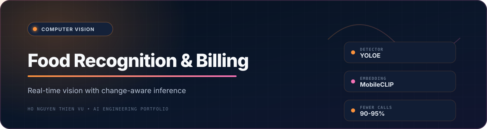
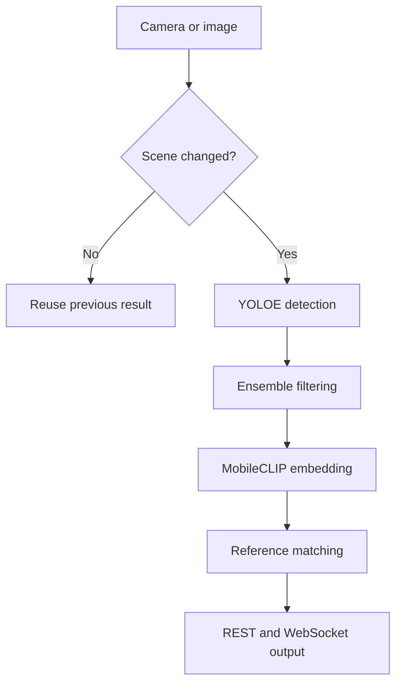

<div align="center">
  
  <br /><br />

  
  
  
  
  
</div>

## Overview

A real-time food recognition pipeline that combines **YOLOE object detection**, **MobileCLIP reference-image matching**, and **SSIM-based scene change detection**. The system exposes both REST and WebSocket interfaces for streaming and billing-oriented integrations.

<div align="center">
  <a href="https://drive.google.com/drive/folders/1cSzTw8m8LVakwSYDJg0ILTHTlpNp12N2?usp=drive_link">
    
  </a>
</div>

## At a Glance

| Change-aware streaming | Tested pipeline latency | Image embedding | Reference classes |
|---:|---:|---:|---:|
| **90-95% fewer YOLOE calls** | **~2-2.5 s/image** | **512 dimensions** | **5 classes** |

> Measurements describe the tested pipeline and configuration in this repository. Performance will vary with hardware, model files, image size, and scene conditions.

## Architecture



## Core Capabilities

| Capability | Implementation |
|---|---|
| **Detection** | YOLOE segmentation with spatial, size, and model-based filtering |
| **Classification** | MobileCLIP embeddings with cosine-similarity reference matching |
| **Streaming optimization** | ROI-based SSIM and frame-difference change detection |
| **Interfaces** | CLI, Python package, FastAPI REST endpoints, and WebSocket streams |
| **Persistence** | SQLite cache for embeddings and detection history |

## Quick Start

### 1. Create the environment

```powershell
python -m venv .venv11
.\.venv11\Scripts\Activate.ps1
pip install -r requirements.txt
```

### 2. Download the required models

The pipeline expects approximately 451 MB of model files. See [`models/DOWNLOAD_MODELS.md`](models/DOWNLOAD_MODELS.md) for the full setup guide.

```powershell
python -c "from ultralytics import YOLO; import shutil; model = YOLO('yolo11l-seg.pt'); shutil.copy(model.ckpt_path, 'models/yoloe-11l-seg-pf.pt')"
python -c "from huggingface_hub import snapshot_download; snapshot_download('apple/MobileCLIP-S2-OpenCLIP', local_dir='models/mobileclip_s2')"
```

### 3. Verify and run

```powershell
python -c "from food_detection import FoodDetectionPipeline; FoodDetectionPipeline(); print('Setup complete')"
python main.py data/images/image_01.jpg
python run_api.py
python tests/test_streaming_demo.py
```

## Usage

### CLI

```powershell
python main.py image.jpg --conf 0.5
```

### Python package

```python
from food_detection import FoodDetectionPipeline

pipeline = FoodDetectionPipeline()
result = pipeline.process_image("image.jpg")
```

### REST API

```python
import requests

response = requests.post(
    "http://localhost:8000/api/v1/detect",
    files={"file": open("image.jpg", "rb")},
)
print(response.json())
```

Example response:

```json
{
  "success": true,
  "data": {
    "detections": [
      {"bbox": [0, 0, 100, 100], "class": "melon", "similarity": 0.889}
    ],
    "count": 1,
    "processing_time": 2.411
  }
}
```

## Change Detection

The streaming layer focuses on the tray region and skips the full inference pipeline when the scene is unchanged.

```python
from food_detection.streaming.change_detector import ChangeDetector

detector = ChangeDetector(
    ssim_threshold=0.94,
    diff_threshold=0.05,
    resize_height=360,
    roi=(96, 72, 544, 408),
)
```

See [`STREAMING_CONFIG.md`](STREAMING_CONFIG.md) for configuration details.

## Supported Reference Classes

The included reference set contains `coconut`, `cua`, `macaron`, `meden`, and `melon`, with six reference images per class.

To add a class, create `data/ref_images/<class_name>/` and add 5-10 representative images.

## Project Structure

```text
Automatic_Food_Recognition_and_Billing_System/
├── food_detection/
│   ├── core/             # Detection, embeddings, and pipeline
│   ├── streaming/        # Change detection, camera, and WebSocket
│   ├── api/              # FastAPI routes
│   └── database.py       # SQLite manager
├── tests/                # Unit and streaming tests
├── static/               # Browser demos
├── data/                 # Test and reference images
├── models/               # Local model files
├── main.py               # CLI entry point
└── run_api.py            # API entry point
```

## Runtime Notes

- The SQLite runtime database is generated locally and intentionally excluded from Git.
- The published latency is not a cross-hardware benchmark.
- Reference-image matching depends strongly on image quality, coverage, and capture conditions.
- Production billing use requires broader validation, monitoring, and failure-handling policies.

## Credits

- [Ultralytics YOLO](https://github.com/ultralytics/ultralytics)
- [Apple MobileCLIP](https://github.com/apple/ml-mobileclip)
